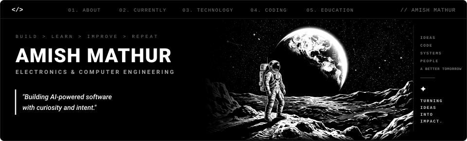
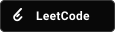
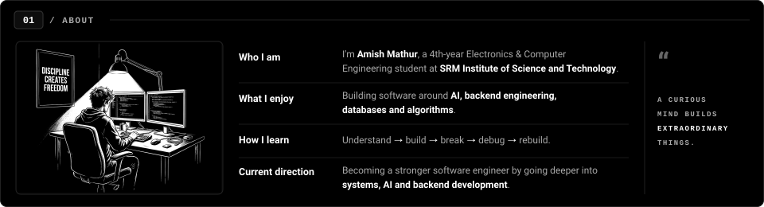
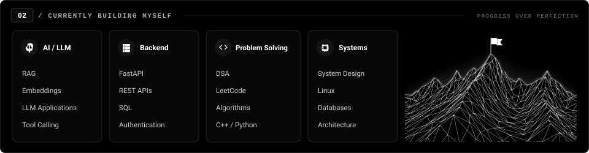
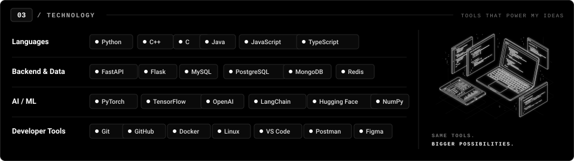
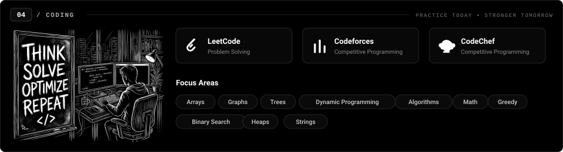
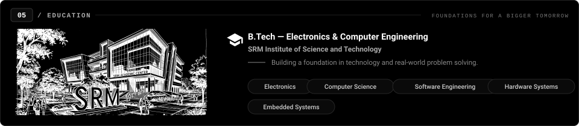
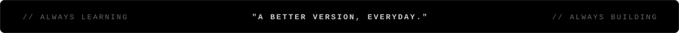

<!-- Hero Section -->

 

<!-- Interactive Social Profiles -->

  
  &nbsp;
  
  &nbsp;
  
  &nbsp;
  
  &nbsp;
  
  &nbsp;
  

 

<!-- 01 / ABOUT -->

  

<!-- 02 / CURRENTLY BUILDING MYSELF -->

  

<!-- 03 / TECHNOLOGY -->

  

<!-- 04 / CODING -->

  

<!-- 05 / EDUCATION -->

  

<!-- Terminal Status Footer -->

  

<!-- Profile Views Counter -->

